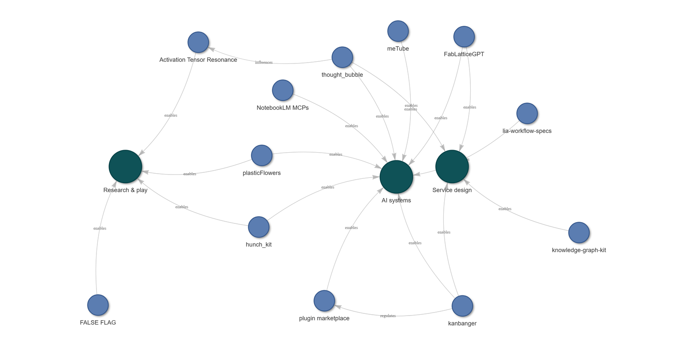

# Hi, I'm Thom

**Service designer who builds.** I design services, programmes and tools that help people gain clarity, and navigate towards their goals.

My building work sits in applied AI: human-in-the-loop tools, evals, and agent systems built on MCP — service design made executable.

I believe effective use of AI-as-collaborator has the potential to radically reshape the landscape of digital engagement, professional development and making ideas real — and these projects represent my journey of learning through the process of making.

  
   
  <em>My public practice, mapped with my own <a href="https://github.com/earlyprototype/knowledge-graph-kit">knowledge-graph-kit</a> — <strong><a href="https://earlyprototype.github.io/knowledge-graph-kit/">click to explore it live</a></strong>.</em>

---

## Design & method

- **[knowledge-graph-kit](https://github.com/earlyprototype/knowledge-graph-kit)** — An LLM-integrated knowledge graph tool: stakeholder influence, value flows, and insight provenance as first-class data with systems-mapping and ecosystem-mapping templates.
- **[FabLatticeGPT](https://github.com/earlyprototype/FabLatticeGPT)** — A project discovery-before-assessment AI advisor for FabLab members: its job is to prevent solutioning before an idea is properly explored. Built via the OpenAI SME Accelerator; deployed and in use with real FabLab members.
- **[FALSE FLAG](https://github.com/earlyprototype/false-flag)** — An LLM-driven crisis simulation: multi-agent cabinet advisors and foreign diplomatic staff, free-form adjudicated decisions, grounded in real NATO wargaming research.

## MCP servers & agent tooling

- **[kanbanger](https://github.com/earlyprototype/kanbanger)** — An MCP kanban server with Github Projects board sync and server-side enforced gated actions for seamless, multi-agent collaboration. Now on PyPI: `pipx install kanbanger`. 
- **[thought_bubble](https://github.com/earlyprototype/thought_bubble)** — An MCP server that turns documents into themed, self-contained HTML with server-rendered Mermaid diagrams and D3 charts — offline, one pipeline. 
- **[notebooklm-py-MCP](https://github.com/earlyprototype/notebooklm-py-MCP)** — Exposes Google NotebookLM as 72 agent tools. (includes a 14-tool lite edition for daily use.)
- **[hunch_kit](https://github.com/earlyprototype/hunch_kit)** — A local-first experiment framework — isolate one variable, track lineage, score by human judgement — with a full MCP server. 

## Orchestrating AI agents

- **[early-prototype](https://github.com/earlyprototype/early-prototype)** — **My Claude Code plugin/skills marketplace**
- **[lia-workflow-specs](https://github.com/earlyprototype/lia-workflow-specs)** — *Slow-code*: an 18-workflow prompt framework for deliberate AI development.

## Applied AI tools

- **[meTube](https://github.com/earlyprototype/meTube)** — A TypeScript CLI turning YouTube history into a searchable knowledge base (dual transcript pipeline + Gemini). 
- **[plasticFlowers](https://github.com/earlyprototype/plasticFlowers)** — A real-time speech → knowledge-graph engine (Gemini, Neo4j, Redis Streams) with a hand-built graph-physics layout.

## Research

- **[Activation Tensor Resonance](https://github.com/earlyprototype/lucier-gpt2-activ-tensor-reson-experiments)** — Looped GPT-2's own activations back through itself 500× and found it collapsed to one of five words — then built a 125-prompt sweep to see what would happen... 

## Art

- **[crucible-demoscene](https://github.com/earlyprototype/crucible-demoscene)** — Terminal boot sequences and a real-time 3D "breathing crystal" visualization, salvaged from a paused AI framework and restaged in the demoscene tradition.

---

**Get in touch** — [LinkedIn](https://www.linkedin.com/in/thom-conaty) · [thomconatydesign@gmail.com](mailto:thomconatydesign@gmail.com)
